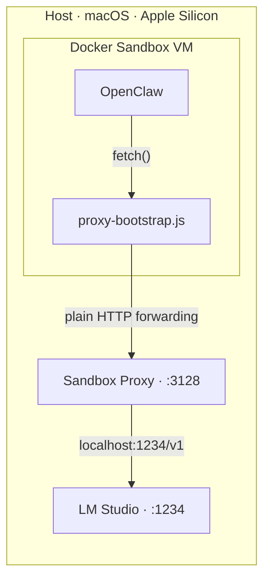

# OpenClaw in a Docker Sandbox VM with a Local LLM

> Run OpenClaw inside an isolated Docker Sandbox microVM, connected to a local LLM served by LM Studio — fully offline, no cloud calls.

This step-by-step tutorial builds the sandbox **from scratch** (no pre-built template) and walks you through routing Node.js `fetch()` through the sandbox proxy to a host-local **GLM 4.7 Flash** model. Everything stays on your machine — no API keys leave your laptop.

> [!TIP]
> Want to skip the manual steps? Run [`./setup.sh`](#quick-setup) to automate the entire setup in one command.

## What you'll learn

- Set up a Docker Sandbox microVM from scratch
- Route Node.js `fetch()` through the sandbox proxy to a host-local LLM
- Configure OpenClaw to use a local GLM 4.7 Flash model via LM Studio
- Save a reusable sandbox template for future projects

## Quick Setup

Prefer automation over copy-pasting? Run the setup script:

```bash
./setup.sh --name openclaw-local --workspace ~/Temp/docker-sandbox-openclaw
```

This executes all tutorial steps automatically (Steps 2–7). You still need LM Studio running with the model loaded (Step 1). Run `./setup.sh --help` for all options:

| Flag | Default | Description |
|---|---|---|
| `--name` | *(required)* | Sandbox name |
| `--workspace` | *(required)* | Host directory to mount |
| `--lm-url` | `http://localhost:1234/v1` | LM Studio API base URL |
| `--model` | `zai-org/glm-4.7-flash` | Model ID |
| `--node-version` | `24` | Node.js version |
| `--template` | *(none)* | Save sandbox as a reusable template |
| `--install-daemon` | `false` | Configure the gateway and auto-start it via `.bashrc` |
| `--skip-verify` | `false` | Skip connectivity tests |

## Prerequisites

| Requirement | Details |
|---|---|
| **macOS** | Apple Silicon (M1/M2/M3/M4) for MLX acceleration |
| **Docker Desktop** | Sandbox CLI enabled (nightly/beta channel). Workspace directory must be allowed in **Settings → Resources → File Sharing** |
| **LM Studio** | [lmstudio.ai](https://lmstudio.ai) with `zai-org/glm-4.7-flash` MLX model downloaded |
| **Time** | ~30–45 min |
| **Level** | Intermediate |

## Architecture



### Why the proxy chain?

The Docker Sandbox is a **microVM** — its `localhost` is its own, not the host's. When OpenClaw tries to reach `http://localhost:1234` (LM Studio), it hits the sandbox's empty localhost. The only way out is through a **proxy** at `192.168.65.254:3128` that bridges the sandbox to the host.

### Why does Node.js need special proxy handling?

Most CLI tools (like `curl`) natively support proxies via environment variables. **Node.js does not** — its built-in `fetch()` ignores `HTTP_PROXY` and connects directly. We intercept `fetch()` and reroute it through the proxy using a small bootstrap script.

- **undici** — the HTTP client bundled inside Node.js that powers `fetch()`. It has a `ProxyAgent` that can route through a proxy, but it's not enabled by default.
- **`proxy-bootstrap.js`** — loaded before OpenClaw starts (via `NODE_OPTIONS="--require ..."`). It creates an undici `ProxyAgent` and replaces `globalThis.fetch` so all requests route through the proxy transparently.

> [!NOTE]
> Standard approaches (`--use-env-proxy`, `global-agent`) use **HTTP CONNECT tunneling**, which the Docker Sandbox proxy doesn't support. Our bootstrap uses undici's `ProxyAgent` with `proxyTunnel: false` to force **plain HTTP forwarding** instead. See [Troubleshooting](#troubleshooting) for the full technical breakdown.

### What about environment variables?

Docker Sandboxes **do not** propagate all host environment variables into the VM. Only API keys for [supported providers](https://docs.docker.com/ai/sandboxes/security/credentials/) are forwarded automatically — and even then, the credentials **stay on the host**. The sandbox proxy intercepts outbound API requests and injects the appropriate authentication headers before forwarding.

Supported credentials:

| Provider | Environment Variable(s) |
|---|---|
| Anthropic | `ANTHROPIC_API_KEY` |
| OpenAI | `OPENAI_API_KEY` |
| Google | `GEMINI_API_KEY`, `GOOGLE_API_KEY` |
| GitHub | `GH_TOKEN`, `GITHUB_TOKEN` |
| AWS | `AWS_ACCESS_KEY_ID`, `AWS_SECRET_ACCESS_KEY` |
| Groq | `GROQ_API_KEY` |
| Mistral | `MISTRAL_API_KEY` |
| xAI | `XAI_API_KEY` |
| Nebius | `NEBIUS_API_KEY` |

This is why we use a **local LLM** in this tutorial — there's no built-in credential forwarding for LM Studio. Our proxy bootstrap handles the routing manually instead.

### Why no WebUI?

Docker Sandbox VMs currently **do not support port forwarding** to the host. The OpenClaw gateway and WebUI run inside the sandbox, but you cannot reach them from a browser on the host. This means you must use OpenClaw in **headless mode** — interact via the CLI (`openclaw agent`) only. This is also why `--skip-ui` is used during onboarding.

## Step 1 — Start LM Studio

1. Open LM Studio → **Discover** tab → search `zai-org/glm-4.7-flash`
2. Download the **MLX** variant (not GGUF — MLX is significantly faster on Apple Silicon)
3. Go to **Developer** tab → select the model → click **Start Server**
4. The server listens at `http://localhost:1234/v1` by default

Verify from your terminal:

```bash
curl http://localhost:1234/v1/models
```

You should see a JSON response listing the loaded model. Note the exact model `id` — you'll need it later.

> [!TIP]
> MLX is Apple's native ML framework, optimized for the unified memory architecture and Metal GPU. On Apple Silicon, MLX models run noticeably faster than GGUF (llama.cpp). Always prefer MLX variants when running on Mac.

## Step 2 — Create a Blank Sandbox

Create a workspace directory and the sandbox:

```bash
mkdir -p ~/Temp/docker-sandbox-openclaw
cd ~/Temp/docker-sandbox-openclaw
docker sandbox create --name openclaw-local shell .
```

This creates a sandbox microVM named `openclaw-local` using the default **shell** agent type. The `.` mounts the current directory as the workspace inside the sandbox. Unlike traditional Docker volume mounts, the workspace appears at the **same absolute path** as on the host (e.g. `~/Temp/docker-sandbox-openclaw` on both sides). No `-t` template flag — we start from the base image which has **Node.js 20** pre-installed.

> [!IMPORTANT]
> The workspace folder must be enabled for file sharing in Docker Desktop, otherwise changes made on the host won't appear in the sandbox and vice versa. Go to **Docker Desktop → Settings → Resources → File Sharing** and add the workspace directory (or a parent directory). Without this, files created on either side won't synchronize.

> [!NOTE]
> The sandbox is created but not started yet. We need to install tools and configure networking first.

**Checkpoint:** Run `docker sandbox ls` — you should see `openclaw-local` listed.

## Step 3 — Install OpenClaw Inside the Sandbox

Open an **interactive root shell** inside the sandbox:

```bash
docker sandbox exec --user root -it openclaw-local bash
```

> [!WARNING]
> Without `-it`, the session doesn't attach properly. Without `--user root`, `apt-get` and `npm install -g` fail with `Permission denied`. Always use `--user root` from outside — `su` doesn't work smoothly inside the sandbox.

### 3a. Install system dependencies

```bash
apt-get update && apt-get install -y curl vim-tiny
```

### 3b. Upgrade Node.js to 24

The base image ships Node.js 20. OpenClaw recommends Node.js 24 (minimum 22.14):

```bash
npm install -g n
n 24
hash -r
node --version   # should show v24.x
```

### 3c. Install OpenClaw

```bash
npm install -g openclaw@latest
openclaw --version
```

> [!IMPORTANT]
> Don't run `openclaw onboard` yet — it verifies model connectivity, which requires the proxy setup from Steps 3d and 4.

### 3d. Set up the proxy for Node.js

Install undici and create the bootstrap script:

```bash
npm install -g undici
```

```bash
NPM_GLOBAL=$(npm root -g)
echo "const undici = require(\"${NPM_GLOBAL}/undici\"); undici.setGlobalDispatcher(new undici.ProxyAgent({ uri: \"http://192.168.65.254:3128\", proxyTunnel: false })); globalThis.fetch = undici.fetch;" > /usr/local/bin/proxy-bootstrap.js
```

This dynamically resolves the global `node_modules` path via `npm root -g`, so it works regardless of the base image's npm layout.

Write `NODE_OPTIONS` to both users' `.bashrc` and activate it:

```bash
PROXY_LINE='export NODE_OPTIONS="--require /usr/local/bin/proxy-bootstrap.js"'

echo "$PROXY_LINE" >> /home/agent/.bashrc
echo "$PROXY_LINE" >> /root/.bashrc
export NODE_OPTIONS="--require /usr/local/bin/proxy-bootstrap.js"
```

Quick test:

```bash
node -e "console.log('proxy-bootstrap loaded, NODE_OPTIONS OK')"
```

If this prints the message without `MODULE_NOT_FOUND` errors, the bootstrap is working.

**Checkpoint:** Node.js 24, OpenClaw, and undici are installed. The bootstrap script loads without errors. **Exit** the root shell — the next step runs from the host.

## Step 4 — Configure Networking

From your **host terminal**, allow the sandbox proxy to forward requests to localhost:

```bash
docker sandbox network proxy openclaw-local --allow-host localhost
```

This tells the proxy that requests targeting `localhost` should be forwarded to the **host's** `localhost:1234` — where LM Studio is serving the model.

## Step 5 — Verify Proxy Connectivity & Configure OpenClaw

Re-enter the sandbox as the **agent** user (not root!):

```bash
docker sandbox exec -it openclaw-local bash
```

> [!WARNING]
> OpenClaw stores its config in `~/.openclaw/openclaw.json`. If you configure as `root`, the config goes to `/root/.openclaw/` — but `docker sandbox run` starts as `agent`, which reads from `/home/agent/.openclaw/`. Always configure as the same user that will run OpenClaw.

Verify `NODE_OPTIONS`:

```bash
echo $NODE_OPTIONS
# Must show: --require /usr/local/bin/proxy-bootstrap.js
```

### 5a. Test the proxy chain

**With `curl`:**

```bash
curl --noproxy "" -x http://host.docker.internal:3128 http://localhost:1234/v1/models
```

**With Node.js `fetch()`:**

```bash
node -e "fetch('http://localhost:1234/v1/models').then(r=>r.json()).then(d=>console.log('SUCCESS',JSON.stringify(d).substring(0,80))).catch(e=>console.log('FAIL',e.message))"
```

> [!NOTE]
> The `curl` command uses two URLs: `-x http://host.docker.internal:3128` is the **proxy address**, and `http://localhost:1234/v1/models` is the **target URL**. `--noproxy ""` is required because `curl` bypasses the proxy for `localhost` by default.

### 5b. Configure OpenClaw for LM Studio

Run the onboarding wizard:

```bash
openclaw onboard
```

When prompted:

| Prompt | Value |
|---|---|
| Security warning | Yes |
| Setup mode | **QuickStart** |
| Model/auth provider | **Custom Provider** |
| API Base URL | `http://localhost:1234/v1` |
| API key | `lm-studio` (any placeholder) |
| Endpoint compatibility | **OpenAI-compatible** |
| Model ID | `zai-org/glm-4.7-flash` |

> [!TIP]
> You can run onboarding non-interactively:
> ```bash
> openclaw onboard --non-interactive --accept-risk \
>   --auth-choice custom-api-key \
>   --custom-base-url http://localhost:1234/v1 \
>   --custom-api-key lm-studio \
>   --custom-compatibility openai \
>   --custom-model-id zai-org/glm-4.7-flash \
>   --skip-skills --skip-channels --skip-search --skip-ui --skip-health
> ```

> [!WARNING]
> The `--install-daemon` flag installs the gateway as a systemd user service — but **Docker Sandbox VMs don't have systemd**. The flag will configure the gateway but print "Systemd user services are unavailable; skipping service install."
>
> **Workaround:** Add the gateway startup to `.bashrc` so it launches automatically when the sandbox starts:
> ```bash
> cat >> ~/.bashrc <<'EOF'
>
> # Auto-start OpenClaw gateway in the background
> if ! pgrep -f "openclaw gateway run" >/dev/null 2>&1; then
>   nohup openclaw gateway run >/dev/null 2>&1 &
> fi
> EOF
> ```
> The `pgrep` guard prevents duplicate processes if `.bashrc` is sourced multiple times.

### 5c. Verify the default model

```bash
openclaw models status
```

If the `Default` line doesn't show your LM Studio model, fix it:

```bash
openclaw config set models.providers.lm-studio '{"baseUrl":"http://localhost:1234/v1","apiKey":"lm-studio","models":[{"id":"zai-org/glm-4.7-flash","name":"GLM 4.7 Flash","api":"openai-completions"}]}'
openclaw models set lm-studio/zai-org/glm-4.7-flash
```

Verify:

```bash
openclaw models status
# Default should now show: lm-studio/zai-org/glm-4.7-flash
```

**Checkpoint:** `openclaw models status` shows `lm-studio/zai-org/glm-4.7-flash` as default. Both `curl` and `fetch()` tests pass. The sandbox is fully configured.

## Step 6 — Save the Template

Snapshot the sandbox so you never have to repeat the setup:

```bash
docker sandbox save openclaw-local openclaw-lmstudio:v1
```

> [!NOTE]
> If you get `host Docker is not available`, export as a tar file instead:
> ```bash
> docker sandbox save openclaw-local openclaw-lmstudio:v1 --output ~/openclaw-lmstudio.tar
> ```

This saves the entire filesystem state — installed packages, config files, everything. Workspace files are **not** included (they're bind-mounted at runtime), so the template is reusable across projects.

To reuse with a different project:

```bash
# Create a new sandbox from the saved template
docker sandbox create --load-local-template -t openclaw-lmstudio:v1 --name my-project shell ~/some-project

# Re-apply the proxy rule (not saved in the template)
docker sandbox network proxy my-project --allow-host localhost

# Launch it
docker sandbox run my-project
```

> [!IMPORTANT]
> `docker sandbox save` captures the filesystem state only. Network proxy rules must be re-applied for each new sandbox created from the template.

## Step 7 — Launch & Verify

Start the sandbox:

```bash
docker sandbox run openclaw-local
```

Verify proxy connectivity inside the sandbox:

```bash
# With curl
curl --noproxy "" -x http://host.docker.internal:3128 http://localhost:1234/v1/models

# With Node.js fetch()
node -e "fetch('http://localhost:1234/v1/models').then(r=>r.json()).then(d=>console.log('SUCCESS')).catch(e=>console.log('FAIL',e.message))"
```

Test OpenClaw with the local LLM:

```bash
openclaw agent --local --session-id test -m "Hello, what model are you?"
```

- `--local` — runs the embedded agent directly, no gateway needed
- `--session-id test` — required session identifier
- `-m "..."` — the message to send

Confirm the response comes from GLM 4.7 Flash (no `401` errors, no `connection error`, doesn't mention being Claude/GPT).

If you added the gateway auto-start to `.bashrc` (see [Step 5b](#5b-configure-openclaw-for-lm-studio)), the gateway is already running. You can use `openclaw agent` without `--local`:

```bash
openclaw agent --session-id test -m "Hello, what model are you?"
```

## Troubleshooting

<details>
<summary><code>curl</code> returns no output or <code>Could not connect to server</code></summary>

`curl` bypasses the proxy for `localhost` by default. Use **both** flags:
```bash
curl --noproxy "" -x http://host.docker.internal:3128 http://localhost:1234/v1/models
```
</details>

<details>
<summary><code>curl: connection refused</code> inside the sandbox</summary>

LM Studio is not running, or `--allow-host localhost` was not set:
```bash
docker sandbox network proxy openclaw-local --allow-host localhost
```
</details>

<details>
<summary>Node.js <code>fetch()</code> returns <code>FAIL fetch failed</code></summary>

- Check `NODE_OPTIONS`: `echo $NODE_OPTIONS` should show `--require /usr/local/bin/proxy-bootstrap.js`
- Check the bootstrap script exists: `cat /usr/local/bin/proxy-bootstrap.js`
- Check undici is installed: `ls $(npm root -g)/undici/`
- If re-entering the sandbox, `.bashrc` must be sourced (use `-it` for interactive shells)
</details>

<details>
<summary>Why <code>--use-env-proxy</code> and <code>global-agent</code> don't work</summary>

The Docker Sandbox proxy only supports **plain HTTP forwarding** (`GET http://full-url`). Standard Node.js proxy approaches use **HTTP CONNECT tunneling**, which the proxy rejects:

- **`--use-env-proxy`** — routes through undici's built-in proxy agent, which uses CONNECT
- **`global-agent`** — v4 removed `bootstrap.js`; even with a custom bootstrap, it uses CONNECT
- **undici `ProxyAgent` (default)** — uses CONNECT for tunneling

Our fix: undici `ProxyAgent` with `proxyTunnel: false` forces plain HTTP forwarding.
</details>

<details>
<summary><code>401 authentication_error</code> or wrong model (anthropic instead of lm-studio)</summary>

Most common cause: OpenClaw was configured as `root` but runs as `agent`. Config lives at `~/.openclaw/openclaw.json` — each user has their own.

- Check: `openclaw models status` — look at the `Default` line
- Fix: `openclaw models set lm-studio/zai-org/glm-4.7-flash`
- If the provider isn't configured: run `openclaw config set models.providers.lm-studio '{"baseUrl":"http://localhost:1234/v1","apiKey":"lm-studio","models":[{"id":"zai-org/glm-4.7-flash","name":"GLM 4.7 Flash","api":"openai-completions"}]}'`
</details>

<details>
<summary><code>LLM request failed: network connection error</code> with correct model</summary>

`NODE_OPTIONS` is not set or has the wrong value:
- Check: `echo $NODE_OPTIONS` — must show `--require /usr/local/bin/proxy-bootstrap.js`
- If stale: `export NODE_OPTIONS="--require /usr/local/bin/proxy-bootstrap.js"`
- Permanent fix: edit `~/.bashrc`, remove old `NODE_OPTIONS` lines, keep only the proxy-bootstrap one
</details>

<details>
<summary><code>NODE_OPTIONS</code> has a stale or wrong value</summary>

Multiple `export NODE_OPTIONS=...` lines in `.bashrc` — the last one wins:
```bash
grep NODE_OPTIONS ~/.bashrc
# Should show exactly one line with proxy-bootstrap.js
```
</details>

<details>
<summary>Workspace files not syncing between host and sandbox</summary>

Unlike traditional Docker volume mounts, Docker Sandbox workspaces require explicit file sharing permissions. If files you create on the host don't appear inside the sandbox (or vice versa):

1. Open **Docker Desktop → Settings → Resources → File Sharing**
2. Add the workspace directory (or a parent directory like `~/Temp`)
3. Restart the sandbox: `docker sandbox stop openclaw-local && docker sandbox run openclaw-local`

Note: the workspace is mounted at the **same absolute path** inside the sandbox as on the host — not at `/home/agent/workspace` like a traditional bind mount.
</details>

<details>
<summary>Other common issues</summary>

- **`model not found`** — model ID doesn't match LM Studio. Check with `curl http://localhost:1234/v1/models`
- **`npm 404 Not Found`** — the package is `openclaw`, not `@anthropic/openclaw`
- **`Permission denied`** — use `docker sandbox exec --user root -it openclaw-local bash`
- **Smart quotes** — copy-pasting from web articles introduces curly quotes. Re-type manually
- **Tool calling** — `glm-4.7-flash` may not fully support OpenAI-style function calling. Test with simple prompts first
</details>

## Alternative: Lume (macOS)

On Apple Silicon, **[Lume](https://docs.openclaw.ai/install/macos-vm#local-vm-on-your-apple-silicon-mac-lume)** spins up a full sandboxed macOS VM using Apple's native Virtualization framework. No proxy setup needed — LM Studio and OpenClaw can both run inside the same VM. Trade-off: ~60 GB disk and ~20 min setup per VM, but you get a complete macOS environment.

## Key Takeaways

- **Docker Sandbox microVMs isolate `localhost`** — the proxy at `192.168.65.254:3128` bridges the gap, and `--allow-host localhost` whitelists the traffic
- **Node.js ignores `HTTP_PROXY`** — `proxy-bootstrap.js` replaces `globalThis.fetch` with an undici `ProxyAgent` using plain HTTP forwarding (`proxyTunnel: false`)
- **User matters for config** — install and configure OpenClaw as the `agent` user, since `docker sandbox run` starts as `agent`
- **Templates save setup, not network rules** — proxy rules must be re-applied per sandbox

## Next Steps

- **Try a real task** — point the workspace at a project and run `openclaw agent --local --session-id dev -m "Review the code in this workspace"`
- **Experiment with models** — swap GLM 4.7 Flash for Qwen, Llama, etc. via `openclaw models set`
- **Explore tool calling** — test whether your model supports OpenAI-style function calling with file/shell tasks
